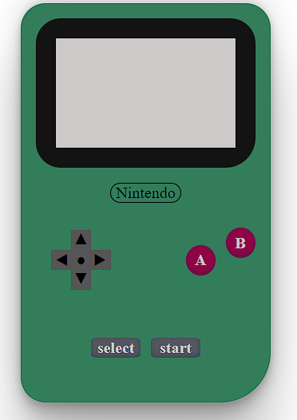

# Videogame Console Proyect

## Objective 🎯

The purpose of this proyect is to reproduce the image of my favourite videogame console using HTML5 and CSS3 with the use of flex box, showcasing my habilities on these subjetcs

## About the project 🔎

I decided to put my knowledge of flex box, CSS and HTML to the test, and what better way of doing so that portraying a beautiful Nintendo GameBoy! 
In the files you will see an HTML document with the structure ready to add flex-box and CSS styles to put the Gameboy together as well as the CSS file that is giving life to this amazing console that we all enjoy.

## Local Usage

1. Clone the repository
2. Go live with any code editor
3. Enjoy!

## Stack

 

 
## Views

Basic gameboy layout view :

 

## Deploy 🚀

Hope you find it useful, here is the
 <a href="https://fran1893.github.io/gameconsole_project/" target="_blank">Url to the demo!!</a>

